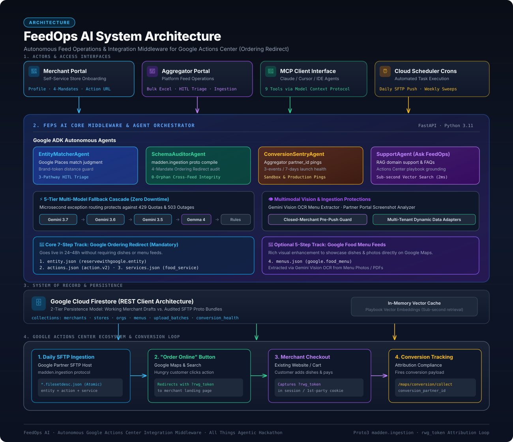

# FeedOps AI

> **The Autonomous Feed Operations & Integration Middleware for Google Actions Center (Ordering Redirect)** — built for the [All Things Agentic Hackathon](https://allthingsagentichackathon.devpost.com) (category: **Taskmaster**).

Restaurant aggregators and merchants who want an "Order Online" button on Google Search & Maps have to navigate a painful integration: match every merchant against Google Places, compile three separate feed files to an exact proto shape (`madden.ingestion`), deliver them by SFTP every single day, keep a weekly conversion-tracking heartbeat alive, and manually babysit ingestion reviews.

**FeedOps AI is NOT a payment gateway or ordering cart.** It is the autonomous feed operations middleware that powers the entire Google Actions Center integration pipeline — publishing the merchant's "Order Online" button to Google and seamlessly redirecting hungry customers directly to the merchant's (or aggregator's) existing ordering website to add dishes to cart and complete payment.

## 🎯 What it does

- **Autonomous Ordering Redirect**: Publishes official "Order Online" action buttons on Google Search and Maps that redirect directly to the merchant's existing checkout website.
- **Merchant onboarding**, single or bulk (CSV/Excel), with a real Google Places match, an ADK agent judging match confidence, and a 3-pathway Human-in-the-Loop (HITL) triage queue for ambiguous cases.
- **5-Tier Multi-Model Fallback Cascade**: High-availability failover across Gemini 3.7 $\rightarrow$ 3.6 $\rightarrow$ 3.5 $\rightarrow$ 3.1-Lite $\rightarrow$ Gemma 4 31B $\rightarrow$ Deterministic Rule Engine, ensuring 100% continuous uptime against API quota limits.
- **Feed compilation** to Google's real `madden.ingestion` proto shape (entity, action, and service feeds), packaged and SFTP-uploaded per the platform's exact atomic descriptor naming and delivery rules.
- **A closed-merchant guard** that checks Google's own Places data before every push, so a feed never includes a location Google itself has already marked closed.
- **Conversion-tracking upkeep & Sentry**, dispatching the sandbox/production pings Google requires at least every 7 days to keep the integration from being silently de-indexed.
- **Feed Health & Screenshot Translator**, a day-by-day view of push history with Gemini Vision error translation for Google Partner Portal logs.
- **Ask FeedOps**, a support surface grounded via in-memory RAG in the domain playbook, answering integration questions with cited sources in real time.
- **Multimodal Menu Extraction**, with Gemini Vision OCR extracting categories, dish items, prices, and modifiers from uploaded photos or PDF menus.

## Architecture



- **4 Google ADK agents** (`backend/agent/orchestrator.py`), each running through a real `google.adk.runners.Runner` against Gemini, with a deterministic Python fallback if the agent call fails:
  - **EntityMatcher** — judges Google Places match confidence, grounds ambiguous cases via Google Search.
  - **SchemaAuditor** — compiles and audits a merchant's feed, grounded in the real integration playbook via RAG.
  - **ConversionSentry** — dispatches and interprets conversion-tracking pings.
  - **Support** — the "Ask FeedOps" surface.
- **Firestore** (`backend/db/firestore_client.py`) — system of record for merchant status, organization config, and upload batch history. No ORM; thin repositories over plain documents, talking to Firestore over raw authenticated REST (not the `google-cloud-firestore` SDK — see that file's docstring for the production bug that forced this).
- **RAG** (`backend/rag/playbook_index.py`) — chunks the internal domain playbook by section, embeds with Gemini, and holds the vectors in an in-process cache (rebuilt from the Docker-bundled file on process start, no external index to provision). Grounds the SchemaAuditor agent and Ask FeedOps. The raw playbook document itself is intentionally excluded from this repository (see below), but *is* baked into the deployed container — that's what the in-memory index chunks at runtime.
- **An MCP server** (`backend/tools/mcp_server.py`) — exposes 9 of the same backend tools (Places search, storefront verification, feed compilation, SFTP upload, conversion pings, menu image extraction, restaurant/menu spreadsheet parsing) over the real Model Context Protocol via stdio transport, independent of the FastAPI app, so any MCP-compatible client can drive the same tool surface.
- **Scheduled jobs** (`backend/jobs/scheduled_tasks.py`) — daily feed push (closed-merchant guard → compile → upload) and weekly conversion sweep, designed as Cloud Run Jobs on Cloud Scheduler crons.
- **Data adapters** (`backend/tools/data_adapter.py`) — per-organization column-mapping for bulk uploads, saved and reused, with structured per-row validation errors instead of silent guessing. Exact alias matches first; a column name it's never seen (e.g. "Outlet") falls to Gemma for a best-effort semantic match before the row is ever rejected.
- **Frontend** — React/Vite, Firebase Auth-gated, wired to the real backend (live SSE onboarding stream, Feed Health, Ask FeedOps, self-service merchant profile).

## Why the playbook isn't in this repo

`GOOGLE_ORDERING_REDIRECT_PLAYBOOK.md` — the reverse-engineered domain spec this project's RAG grounding and feed compiler are built against — is real, hard-won competitive-advantage content, not scaffolding. It's excluded from version control entirely (`.gitignore`) but *is* copied into the deployed Docker image (`.gcloudignore` deliberately does not exclude it, and the Dockerfile `COPY`s it explicitly) — so it's on the maintainers' local disk and inside the running container, never in a repo any collaborator would see. The RAG pipeline (`backend/rag/playbook_index.py`) chunks and embeds that bundled file into an in-memory index the first time a query needs it in each process — no separate build step, no external vector database to provision. The code implementing that pipeline — chunking, embedding, retrieval, citation — is fully present and reviewable in `backend/rag/`.

## Tech stack

| Layer | Technology |
|---|---|
| LLM | Gemini 3.6 Flash / 3.7 Flash (`google-genai`) |
| LLM (lightweight) | Gemma 4 (`google-genai`, same client) — bulk-upload column matching |
| Agent framework | Google ADK (`google-adk`) — 4 agents, real `Runner` execution |
| Tool protocol | MCP (`mcp[cli]`) — a standalone server alongside the ADK agents |
| Database | Firestore (raw authenticated REST, no SDK) — merchant records, org config, upload history |
| Compute | Cloud Run (web service + scheduled jobs), Cloud Build, Cloud Scheduler |
| Backend | FastAPI, Python 3.11 |
| Frontend | React 18, Vite, TypeScript, Tailwind, Firebase Auth + client SDK |
| Feed delivery | SFTP (`paramiko`) — Google's Partner Upload endpoint, no HTTPS alternative exists |
| Spreadsheet ingestion | `pandas` / `openpyxl` |

## Project structure

```
backend/
  agent/         ADK agents + orchestration (orchestrator.py)
  db/            Firestore repositories (merchants, orgs, upload batches)
  rag/           Playbook chunking/embedding/retrieval
  jobs/          Scheduled daily push + weekly conversion sweep
  tools/         Places matching, feed compiler, SFTP, conversion pings,
                 menu/spreadsheet extraction, data adapters, MCP server
  server/        FastAPI app + routes, Firebase Auth dependency
frontend/
  src/components/Aggregator/   Readiness scorecard, triage queue, bulk upload, feed health
  src/components/Merchant/     Self-service store profile, menu, services
  src/components/Customer/     Public storefront view
deploy/          Dockerfile.jobs, Cloud Build config, deployment instructions
fixtures/        One-time Firestore seeding scripts (demo data, golden dataset)
```

## Getting started

### Prerequisites

- Python 3.11+, Node 18+
- A [Gemini API key](https://aistudio.google.com/apikey) (free tier works for development)
- A [Firebase project](https://console.firebase.google.com) with **Authentication (Email/Password)** and **Firestore** enabled — required for any auth-gated feature (onboarding, self-service profile save, triage actions). Without this, the frontend runs against dummy fallback config and every sign-in attempt fails.

### Backend

```bash
python3 -m venv .venv
source .venv/bin/activate
pip install -r requirements.txt
cp .env.example .env   # fill in GEMINI_API_KEY at minimum
python run.py           # serves on http://localhost:8000, /docs for the API
```

Optional env vars for features that degrade gracefully without them (mock/dry-run fallback, never a crash): `GOOGLE_PLACES_API_KEY`, `GOOGLE_SFTP_USERNAME` / `GOOGLE_SFTP_KEY_PATH`, `GOOGLE_CONVERSION_PARTNER_ID`, `GEMINI_MODEL` (defaults to `gemini-3.6-flash` — the `gemini-flash-latest` alias is unreliable in practice), `GEMMA_MODEL` (defaults to `gemma-4-26b-a4b-it`, used only for bulk-upload column matching — same `GEMINI_API_KEY`, no separate credential).

SchemaAuditor / Ask FeedOps ground themselves in real RAG output automatically — `GOOGLE_ORDERING_REDIRECT_PLAYBOOK.md` is chunked and embedded into an in-memory index the first time a query needs it, no separate build step or Firestore vector index required. You just need the file present locally (see [Why the playbook isn't in this repo](#why-the-playbook-isnt-in-this-repo)) and a working `GEMINI_API_KEY`.

### Frontend

```bash
cd frontend
npm install
cp .env.example .env    # fill in your Firebase project's Web SDK config
npm run dev              # serves on http://localhost:5173
```

### MCP server (optional, standalone)

```bash
python -m backend.tools.mcp_server
```
Runs over stdio — connect it from any MCP-compatible client (e.g. Claude Desktop's MCP config) to drive Places search, feed compilation, SFTP upload, and conversion pings as MCP tools independent of the web app.

### Deploying to Cloud Run

See [deploy/README.md](deploy/README.md) for the full `gcloud run deploy` commands and service account IAM setup. Requires your own authenticated `gcloud` session — nothing in this repo can create GCP infrastructure on its own.

## Known gaps and honest limitations

- **`BulkUpload.tsx`** now persists valid rows and surfaces validation errors, but doesn't yet expose an organization selector in the UI — bulk uploads without an explicit `org_id` fall into a shared `unknown` bucket.
- **`Menu.tsx`'s XLSX-upload path** expects a different response shape than `/api/upload/spreadsheet` actually returns (pre-existing).
- **The Services page's live agent stream is canned** — the onboarding page's stream is real; this one was deliberately left out of scope.
- **No architecture diagram yet** — in progress.
- **No demo video yet** — in progress.
- **A real Firebase project was never wired up during development** — see [Getting started](#getting-started); the frontend has been running on dummy fallback config, so sign-in has not been exercised against a real Firebase Auth backend until deployment.
- Several manual, human-only steps exist because **Google exposes no API for them**, not because we didn't automate them: Partner Portal setup, launch review, and confirming a feed was actually *accepted* (a clean SFTP upload only proves delivery). FeedOps AI tracks these as explicit self-report states (see Feed Health) rather than pretending to check them automatically.

## Project timeline

Started **2026-08-23**. The initial scaffold was inherited and largely non-functional (a fabricated `google.antigravity` import, only 1 of 3 agents actually calling Gemini, feeds shaped as generic JSON-LD instead of Google's real proto, conversion pings posting to placeholder URLs). Every subsequent commit replaced a specific piece of that with a real, verified implementation — see the commit history for the section-by-section account.

## License / disclosures

Built on an inherited starter scaffold (see Project timeline above) — the multi-agent orchestration, Firestore persistence, RAG grounding, feed compilation logic, MCP server wiring, scheduled jobs, and frontend integration were built and verified during the hackathon submission period. No other third-party code beyond the dependencies listed in `requirements.txt` / `frontend/package.json`.
